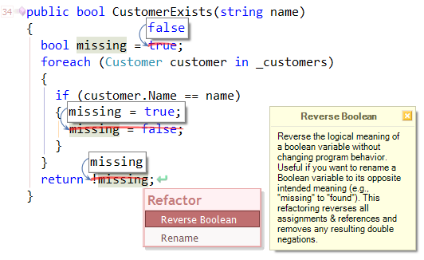

'Reverse Boolean' for CodeRush
===
Reverses the logical meaning of a boolean variable without changing program behavior.

This is useful if you are planning to rename a Boolean variable to it's opposite  meaning.( eg 'missing' -> 'found')

This refactoring reverses all assignments and references and removes any resulting double negations.

Usage
===
Place your caret on a variable whose type is bool/Boolean and invoke "Reverse Boolean" via the refactor menu.

